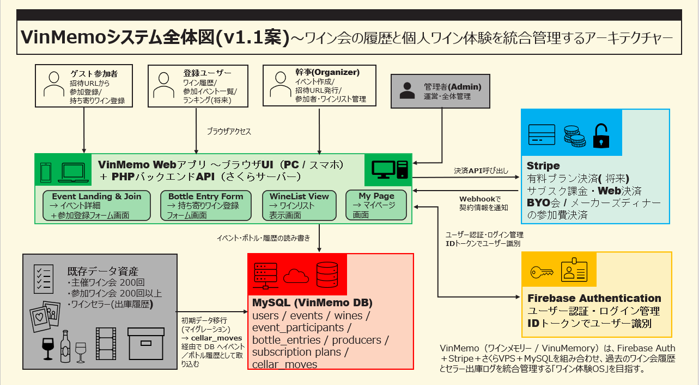
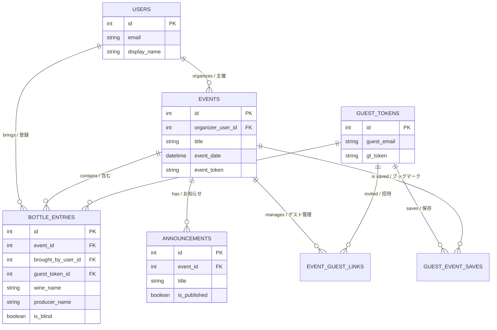

# VinMemo GS Demo

This is a demonstration environment for **"VinMemo"**, a wine event and bottle memory application.
ワインイベントおよびボトル記録アプリ「VinMemo」のレビュー用デモ環境です。

---

## 🔐 1. Access / アクセス

Please access the demo site below. Note that **Basic Authentication** (User/Pass) is required.
以下のデモサイトへアクセスしてください。**ベーシック認証（Basic Auth）** が必要です。

- **URL**: [https://sin2yk.sakura.ne.jp/vinmemo-gs/](https://sin2yk.sakura.ne.jp/vinmemo-gs/)

### Basic Auth Credentials / 認証情報
- **Username / ユーザー名**: `demo`
- **Password / パスワード**: `GS_vinmemo=20251028`

> **Tip**: If the Basic Auth dialog does not appear, please try opening the URL in a **Private/Incognito window**.
> **ヒント**: 認証ダイアログが表示されない場合は、**シークレットウィンドウ（プライベートブラウザ）** で開いてください。

---

## 🚀 2. How to Start / デモの開始方法

1. **Open the URL** above and enter the Basic Auth credentials.
   URLを開き、ベーシック認証情報を入力します。
2. On the top page, you will see **"Choose a Demo Event"**.
   トップページに **「デモイベントを選択 (Choose a Demo Event)」** というメニューが表示されます。
3. **Click one of the event buttons** (e.g., "VinMemo Demo Night") to join as a guest.
   **イベントボタン（例: "VinMemo Demo Night"）** をクリックして、ゲストとして参加してください。

---

## 🍷 3. What You Can Do / できること

- **View Event Details**: Check the wine list, theme, and event info.
  イベント詳細（ワインリスト、テーマ、情報）を閲覧できます。
- **View Bottles**: Browse registered bottles.
  登録されたボトル情報を閲覧できます。
- **Register a Bottle**: If the form is open, you can try adding a dummy bottle.
  フォームが開放されている場合、ダミーボトルの登録を試すことができます。

---

## 🏗 System Architecture (v1.1) / システムアーキテクチャ

## 📑 Business Plan / ビジネスプラン

- [Business Plan (PDF)](docs/businee_plan.pdf)

---

## 📊 System Structure / システム構成 (ER Diagram)

---

## 📚 4. Documents / ドキュメント

- **Manual (English)**: [https://sin2yk.sakura.ne.jp/vinmemo-gs/manual/user-manual-en.html](https://sin2yk.sakura.ne.jp/vinmemo-gs/manual/user-manual-en.html)
- **Manual (日本語)**: [https://sin2yk.sakura.ne.jp/vinmemo-gs/manual/user-manual-ja.html](https://sin2yk.sakura.ne.jp/vinmemo-gs/manual/user-manual-ja.html)
- **Terms / 利用規約**: [https://sin2yk.sakura.ne.jp/vinmemo-gs/terms.php](https://sin2yk.sakura.ne.jp/vinmemo-gs/terms.php)
- **Privacy Policy / プライバシーポリシー**: [https://sin2yk.sakura.ne.jp/vinmemo-gs/privacy.php](https://sin2yk.sakura.ne.jp/vinmemo-gs/privacy.php)

> Note: The manual requires login (Basic Auth) to view.
> 注: マニュアルの閲覧にはログイン（ベーシック認証）が必要です。

---

## ⚠️ Notes / 注意事項

- **Data Reset**: This is a demo environment. Data may be reset without notice.
  デモ環境のため、データは予告なくリセットされる場合があります。
- **Validity**: This environment is planned to be available until **Apr 30, 2026**.
  本環境は **2026年4月30日** までの公開を予定しています。

## 📩 Contact / お問い合わせ

Please contact **T_TUE_09_吉川慎二(シンジ)** for credentials.
アクセス情報については **T_TUE_09_吉川慎二(シンジ)** へお問い合わせください。